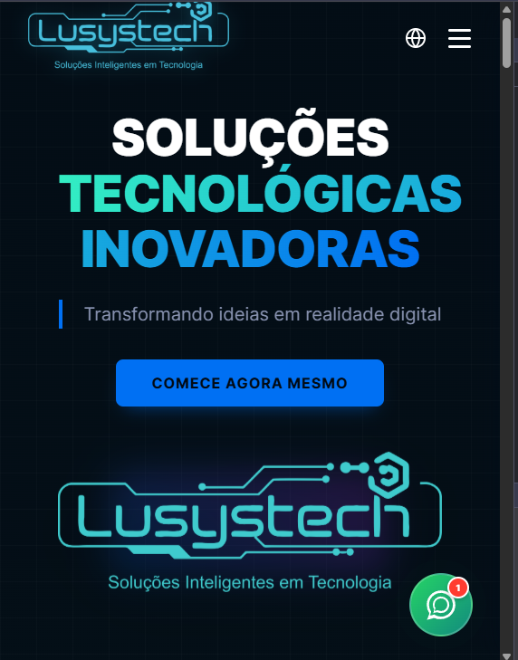
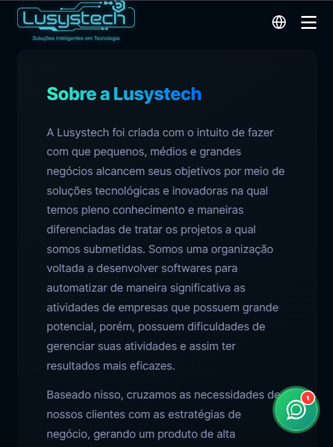
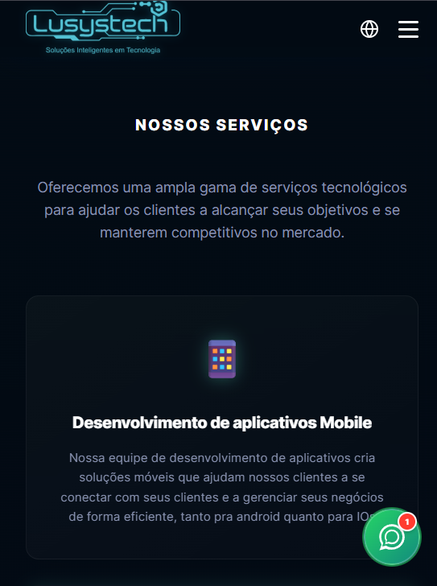
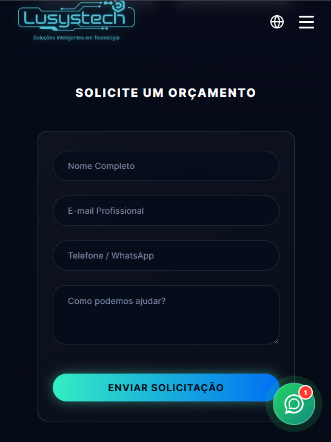

# 🚀 Lusystech Landing Page

Uma landing page moderna, responsiva e multilíngue desenvolvida para a **Lusystech**, focada em apresentar soluções tecnológicas com uma experiência de usuário premium.

## � Demonstração

Aqui você pode ver o visual da nossa landing page:

|                                      Desktop                                       |                                      Mobile                                      |
| :--------------------------------------------------------------------------------: | :------------------------------------------------------------------------------: |
|  |  |
 |  |
 |  |
 |  |


## �🛠️ Tecnologias Utilizadas

Este projeto foi construído utilizando as tecnologias mais modernas do ecossistema web:

- **React 19**: Biblioteca principal para construção da interface.
- **Vite**: Build tool extremamente rápida para o desenvolvimento.
- **Vanilla CSS**: Estilização personalizada sem frameworks pesados, garantindo performance e controle total.
- **i18next & react-i18next**: Implementação robusta de internacionalização (Português e Inglês).
- **Lucide React**: Biblioteca de ícones elegantes e consistentes.

## 🧠 Desafios e Aprendizados

Durante o desenvolvimento desta landing page, enfrentamos e superamos diversos desafios técnicos:

1.  **Responsividade Impecável**: Garantir que o design premium se mantivesse consistente desde dispositivos móveis pequenos até telas UltraWide, utilizando CSS Grid e Flexbox de forma avançada.
2.  **Internacionalização Dinâmica**: Implementar a troca de idiomas em tempo real sem recarregar a página, mantendo o estado da aplicação e garantindo que todos os componentes (inclusive carrosséis e formulários) fossem traduzidos corretamente.
3.  **Componentes de UI Personalizados**: A criação de um carrossel de projetos suave e performático utilizando apenas React e CSS, evitando dependências externas volumosas.
4.  **Performance Sugestiva**: Otimização de carregamento de fontes e ícones para garantir que a primeira impressão do usuário fosse instantânea.

## 📦 Como Executar o Projeto

```bash
# Clone o repositório
git clone https://github.com/seu-usuario/lusystech.git

# Entre no diretório
cd lusystech

# Instale as dependências
npm install

# Inicie o servidor de desenvolvimento
npm run dev
```

---

**Criado por Adriel Luniere**

Este projeto está licenciado sob a [MIT License](LICENSE). Sinta-se à vontade para usar como inspiração, mas lembre-se de respeitar os termos da licença.
